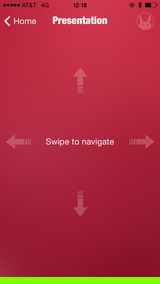

### Tah Motion Control
The Tah Motion app lets you control your PC or Mac with your phone's
motion gestures. Swipe between desktops, control iTunes, VLC or Quick
Time Player and use it as a pointer to advance your Powerpoint or
Keynote presentations... it's magical!

This repository consists of the iOS and Android(coming soon) source code along with the corresponding Arduino sketch for the Tah Motion Control app.

 
   
<a href="https://itunes.apple.com/us/app/tah-motion/id923858114?mt=8#"></img></a>

---

## Usage

#### Arduino
* Install the
[Tah Arduino Library](https://github.com/tah-io/Tah_Arduino_Library#installing)
* Download the
[Tah Motion Control sketch](https://raw.githubusercontent.com/tah-io/Tah-Motion-Control/master/MotionControlSketch/MotionControl.ino)
and open it in the Arduino IDE
* Upload it on your Tah board

#### iOS
* Clone the repo

		git clone https://github.com/tah-io/Tah-Motion-Control.git

* Change directory to the appropriate submodule (iOS or Android)

		cd Tah-Motion-Control-iOS

* Initialize and update the submodule

		git submodule init
		git submodule update
* Open the Xcode project file TAH Motion Control.xcodeproj 

